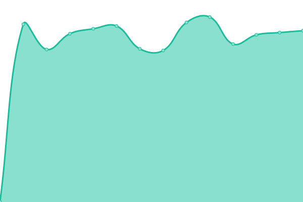

# [📈 Live Status](https://privatereese.github.io/upptime): <!--live status--> **🟧 Partial outage**

This repository contains the open-source uptime monitor and status page for [Bernhard Blieninger](https://privatereese.github.io/upptime), powered by [Upptime](https://github.com/upptime/upptime).

With [Upptime](https://upptime.js.org), you can get your own unlimited and free uptime monitor and status page, powered entirely by a GitHub repository. We use [Issues](https://github.com/privatereese/upptime/issues) as incident reports, [Actions](https://github.com/privatereese/upptime/actions) as uptime monitors, and [Pages](https://privatereese.github.io/upptime) for the status page.

<!--start: status pages-->
<!-- This summary is generated by Upptime (https://github.com/upptime/upptime) -->
<!-- Do not edit this manually, your changes will be overwritten -->
<!-- prettier-ignore -->
| URL | Status | History | Response Time | Uptime |
| --- | ------ | ------- | ------------- | ------ |
|  [Webseite](https://www.edvgarbe.de) | 🟩 Up | [webseite.yml](https://github.com/privatereese/upptime/commits/HEAD/history/webseite.yml) | 

 761ms
     
 | 

<a href="https://privatereese.github.io/upptime/history/webseite">100.00%</a>
    

|  [Nextcloud](https://cloud.edvgarbe.de) | 🟩 Up | [nextcloud.yml](https://github.com/privatereese/upptime/commits/HEAD/history/nextcloud.yml) | 

 1391ms
     
 | 

<a href="https://privatereese.github.io/upptime/history/nextcloud">100.00%</a>
    

|  [Mail](https://mail.edvgarbe.de) | 🟩 Up | [mail.yml](https://github.com/privatereese/upptime/commits/HEAD/history/mail.yml) | 

 964ms
     
 | 

<a href="https://privatereese.github.io/upptime/history/mail">100.00%</a>
    

|  [Bitwarden](https://bitwarden.edvgarbe.de) | 🟩 Up | [bitwarden.yml](https://github.com/privatereese/upptime/commits/HEAD/history/bitwarden.yml) | 

 764ms
     
 | 

<a href="https://privatereese.github.io/upptime/history/bitwarden">99.80%</a>
    

|  [Suche](https://suche.edvgarbe.de) | 🟥 Down | [suche.yml](https://github.com/privatereese/upptime/commits/HEAD/history/suche.yml) | 

 713ms
     
 | 

<a href="https://privatereese.github.io/upptime/history/suche">0.00%</a>
    

|  [Matrix](https://matrix.edvgarbe.de) | 🟩 Up | [matrix.yml](https://github.com/privatereese/upptime/commits/HEAD/history/matrix.yml) | 

 580ms
     
 | 

<a href="https://privatereese.github.io/upptime/history/matrix">100.00%</a>
    

|  [Latex](https://latex.edvgarbe.de) | 🟥 Down | [latex.yml](https://github.com/privatereese/upptime/commits/HEAD/history/latex.yml) | 

 652ms
     
 | 

<a href="https://privatereese.github.io/upptime/history/latex">0.00%</a>
    

|  [HedgeDoc](https://md.edvgarbe.de) | 🟩 Up | [hedge-doc.yml](https://github.com/privatereese/upptime/commits/HEAD/history/hedge-doc.yml) | 

 730ms
     
 | 

<a href="https://privatereese.github.io/upptime/history/hedge-doc">100.00%</a>
    

|  [Mastodon](https://mastodon.edvgarbe.de) | 🟥 Down | [mastodon.yml](https://github.com/privatereese/upptime/commits/HEAD/history/mastodon.yml) | 

 717ms
     
 | 

<a href="https://privatereese.github.io/upptime/history/mastodon">0.00%</a>
    

|  [Wallabag](https://wallabag.edvgarbe.de) | 🟩 Up | [wallabag.yml](https://github.com/privatereese/upptime/commits/HEAD/history/wallabag.yml) | 

 3276ms
     
 | 

<a href="https://privatereese.github.io/upptime/history/wallabag">100.00%</a>
    

|  [IRC](https://irc.edvgarbe.de) | 🟥 Down | [irc.yml](https://github.com/privatereese/upptime/commits/HEAD/history/irc.yml) | 

 604ms
     
 | 

<a href="https://privatereese.github.io/upptime/history/irc">0.00%</a>
    

<!--end: status pages-->

[**Visit our status website →**](https://privatereese.github.io/upptime)

## 📄 License

- Powered by: [Upptime](https://github.com/upptime/upptime)
- Code: [MIT](./LICENSE) © [Bernhard Blieninger](https://privatereese.github.io/upptime)
- Data in the `./history` directory: [Open Database License](https://opendatacommons.org/licenses/odbl/1-0/)
